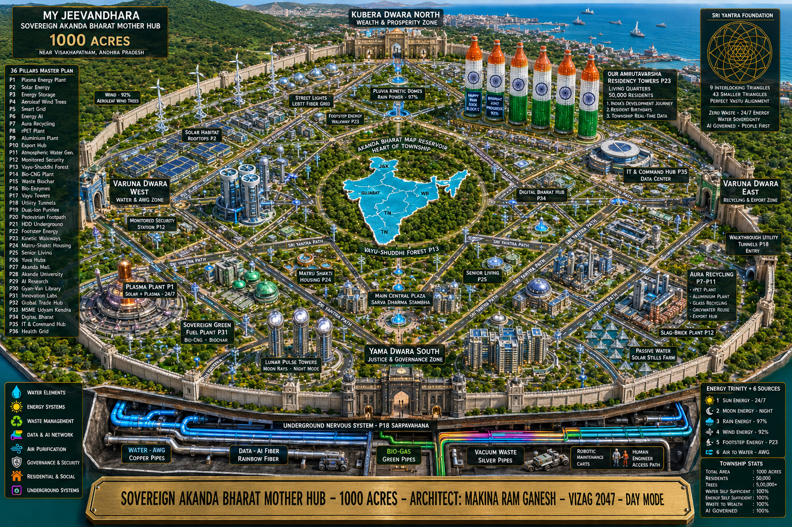

### 🎥 Master Vision Video - 3 Min Investor Pitch

**Tagline: డ్రైవ్ చేస్తూనే చార్జ్ – పార్క్ చేస్తూనే పవర్**  
**Drive Chesthune Charge – Park Chesthune Power**

*Click thumbnail to play 24.69MB Master Vision*

---

# ABST - 36 PILLARS OF AKANDA BHARAT SOVEREIGN TRUST
## Mother Hub: Vizag 1000 Acres | Target: 2047

**Master Visionary: INDIAN.001 RAM GANESH MAKINA**  
**Timestamp: 2026-04-10 | GitHub Proof of Concept | Lock: ABST-MVL-v1.0**

### The Problem - "AI Thirst & Nation Debt"
Future data centers need billions of liters water. India faces water + unemployment + plastic crisis.

### The Solution - 36 Pillars, 12 Sectors
Complete blueprint for Sovereign Bharat. Not just an app. Not just a policy. A SYSTEM.

### Core Pillars Preview:
1. **P1: Plasma Energy** - Free power base
2. **P11: Air to Water / My Jeevandhara** - AI + Public water security  
3. **P12: Soil to Gold** - Water + Agriculture revolution
4. **P29: Make in India Tech** - APK + Open Source
5. **P36: Jarvis AI** - Nation brain

### Proof Files:
- `/app/ABST-APK-v1.0.apk` - Working prototype with MVL Lock
- `/video/ABST-Master-Vision-2026.mp4` - 3 Min Master Vision Pitch
- `/blueprint/` - Mother Hub Day/Night images, 36 Sectors map
- `/constitution.md` - ABST Constitution draft

### License & Credit
Open Source for Nation Building. See LICENSE.md.  
**Attribution Mandatory: INDIAN.001 Ram Ganesh Makina | Master Visionary Lock Protected**

"V
